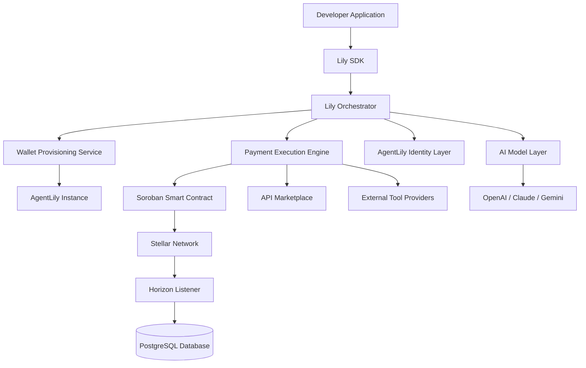

# Lily Protocol

## Autonomous Agent Finance Infrastructure

---

## 1. Overview

Lily Protocol is an on-chain financial infrastructure built on the Stellar network that enables AI agents (AgentLily) to own wallets, hold USDC, execute payments, and transact autonomously.

The protocol provides:

* AI agent wallet provisioning (AgentLily instances)
* Autonomous USDC payments
* Machine-to-machine settlement
* API and tool purchasing
* Agent identity infrastructure

Lily Protocol functions as a Web3-native financial layer where autonomous software agents (AgentLily) can transact, purchase services, and settle payments programmatically in real time using Stellar.

---

## 2. Problem Statement

Traditional payment infrastructure relies on:

* Credit cards and manual billing
* Human authorization workflows
* Centralized payment providers
* Delayed settlement systems
* Limited support for micro-transactions

**Limitations:**

* AI agents cannot natively own programmable wallets
* Machine-to-machine commerce is difficult to automate
* Existing payment systems are not optimized for autonomous software
* Global access to payment infrastructure remains restricted
* Autonomous agents cannot independently purchase APIs or digital services

There is no decentralized infrastructure enabling AI agents to transact autonomously using stablecoins.

---

## 3. Solution

Lily Protocol introduces an **autonomous wallet infrastructure** model powered by AgentLily:

* Developers instantiate AI agents called **AgentLily**
* Each AgentLily is assigned a native Stellar wallet
* Agents receive programmable USDC balances
* AgentLily executes payments autonomously based on task logic
* APIs and digital tools can be purchased programmatically
* Transactions settle transparently on-chain

The system combines smart contracts, wallet orchestration, AgentLily identity layer, and payment execution services.

---

## 4. High-Level Architecture

---

## 5. Repositories

| Repo                   | Description                                                        |
| ---------------------- | ------------------------------------------------------------------ |
| [lily-frontend](#)     | Dashboard and developer-facing web application                     |
| [lily-backend](#)      | Agent orchestration, wallet management, and payment services       |
| [lily-contracts](#)    | Soroban smart contracts for settlement and AgentLily wallet infra  |
| [lily-sdk](#)          | SDK for integrating autonomous payments into AI applications       |
| [agentlily-runtime](#) | Runtime layer where AgentLily instances execute autonomous actions |
